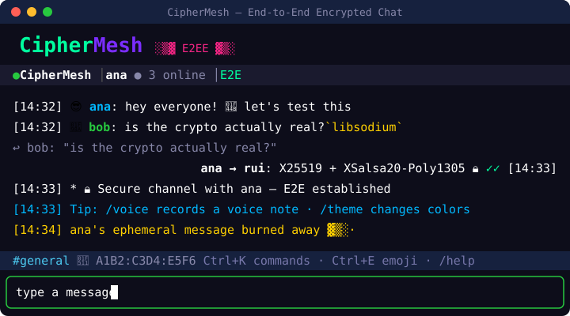

<div align="center">

```
 ██████╗██╗██████╗ ██╗  ██╗███████╗██████╗ ███╗   ███╗███████╗███████╗██╗  ██╗
██╔════╝██║██╔══██╗██║  ██║██╔════╝██╔══██╗████╗ ████║██╔════╝██╔════╝██║  ██║
██║     ██║██████╔╝███████║█████╗  ██████╔╝██╔████╔██║█████╗  ███████╗███████║
██║     ██║██╔═══╝ ██╔══██║██╔══╝  ██╔══██╗██║╚██╔╝██║██╔══╝  ╚════██║██╔══██║
╚██████╗██║██║     ██║  ██║███████╗██║  ██║██║ ╚═╝ ██║███████╗███████║██║  ██║
 ╚═════╝╚═╝╚═╝     ╚═╝  ╚═╝╚══════╝╚═╝  ╚═╝╚═╝     ╚═╝╚══════╝╚══════╝╚═╝  ╚═╝
```

### End-to-end encrypted terminal chat — the server can't read a single word.

[](https://github.com/FelipeKreulich/secret-chat-lan/actions/workflows/ci.yml)
[](LICENSE)
[](package.json)
[](docs/ARCHITECTURE.md)

**[🇧🇷 Leia em Português](README.pt-BR.md)** · [Setup Guide](docs/SETUP.md) · [Architecture](docs/ARCHITECTURE.md) · [Security Policy](SECURITY.md)



</div>

---

```
 You  ──[encrypted payload]──▶  Relay (blind)  ──[encrypted payload]──▶  Friend
        Curve25519 + XSalsa20-Poly1305 · Double Ratchet · zero-knowledge
```

CipherMesh is a terminal chat where **encryption is the product**. Keys live in
locked memory pages, every message gets a fresh ratchet key, and the relay
server only ever sees ciphertext — it can't read, alter, or fake anything.
Works on your LAN out of the box, and across the internet with
[Tailscale](docs/SETUP.md#connecting-over-the-internet-tailscale) (no port
forwarding, survives CGNAT).

## ✨ Highlights

|     | Feature | The gist |
|-----|---------|----------|
| 🔐 | **Real E2EE** | Curve25519 + XSalsa20-Poly1305 via libsodium, keys in `sodium_malloc` — never touch disk |
| 🔄 | **Perfect Forward Secrecy** | Double Ratchet: one key per message, compromise today ≠ read yesterday |
| 🛡️ | **Hybrid post-quantum** | X25519 **+ ML-KEM-768** folded into the ratchet root — beats "harvest now, decrypt later" while staying ≥ classical security ([details](docs/ARCHITECTURE.md)) |
| 🕶️ | **Metadata resistance** | **Sealed sender** — the relay never sees who sent a message — plus fixed-bucket length padding on every ciphertext and opt-in cover traffic (`/cover`) |
| 🕵️ | **TOFU + SAS** | Key-change detection (MITM alarm), 6-digit voice-verifiable codes, and inline **✓/✗** trust badges next to names |
| 🌐 | **LAN & internet** | Auto-detects Tailscale, shows the reachable address in the banner |
| 📨 | **Invites with QR** | `/invite` prints a `ciphermesh://` string + QR — paste it, you're in the right room |
| ✓✓ | **Encrypted read receipts** | The ✓✓ travels as ordinary ciphertext — the server can't tell it apart |
| 🗂️ | **Encrypted local history** | Opt-in (passphrase only), Argon2id + XSalsa20-Poly1305, `/search` & `/export` |
| 🖼️ | **Image previews** | Received photos render right in the chat as colored half-blocks |
| 📎 | **Resumable transfers** | Lost chunks are re-requested; reconnects resume from where they stopped |
| 💬 | **Modern chat feel** | Right-aligned own messages, per-user emoji avatars, replies with quotes, `:fire:` → 🔥 |
| 🎞️ | **Animated UI** | Splash intro, reconnect spinner, live transfer bars (shimmer + ETA), a lock-closing handshake on connect, and a pulsing "new messages ↓" pill |
| 👻 | **Deniable & ephemeral** | Symmetric-crypto deniable mode; ephemeral messages *burn away* char-by-char when they expire |
| 🔒 | **Private rooms** | `/create <room> <password>` — zero-knowledge: the password never leaves your machine (Argon2id → Ed25519 challenge-response) and room content gets an extra symmetric layer the relay can't fake its way into |
| 🛰️ | **Serverless P2P mode** | mDNS peer discovery on the LAN — no relay at all |
| 🧩 | **Plugins** | Drop a JS file in `~/.ciphermesh/plugins` and get new slash-commands — `/roll` and `/poll` examples included ([Plugin API](docs/PLUGINS.md)) |

## 🚀 Quick start

Run it without cloning (once published to npm):

```bash
npx ciphermesh          # client (default)
npx ciphermesh server   # relay server
npx ciphermesh p2p      # serverless P2P
```

macOS/Linux with Homebrew (see [`Formula/ciphermesh.rb`](Formula/ciphermesh.rb)):

```bash
brew tap felipekreulich/ciphermesh
brew install ciphermesh
```

Or from source:

```bash
git clone https://github.com/FelipeKreulich/secret-chat-lan.git
cd secret-chat-lan
npm install
```

**Host** (one machine runs the relay):

```bash
npm run server          # or: docker compose up -d  |  npx ciphermesh server
```

Prefer a prebuilt image? Pull the relay from GHCR (published on each release):

```bash
docker run -p 3600:3600 ghcr.io/felipekreulich/secret-chat-lan:latest
```

**Everyone** (including the host):

```bash
npm run client          # nickname → passphrase (optional) → server address
```

On the same network, use the LAN IP from the server banner (`192.168.x.x:3600`).
Across the internet, install [Tailscale](https://tailscale.com) on both sides
and use the `Internet` address from the banner — full walkthrough in
[docs/SETUP.md](docs/SETUP.md).

Already in the chat? Run `/invite <your-ip>:3600` and send the string (or the
QR code) to whoever you want to pull in.

**No server at all?** `npm run p2p` — peers find each other via mDNS.

## 💬 Commands

<details>
<summary><b>Essentials</b></summary>

| Command | Description |
|---------|-------------|
| `/help` | All commands |
| `/tips` | Show a rotating security/UX tip |
| `/users` | Who's online (with away/status) |
| `/msg <nick> <text>` | Private message (DM) |
| `/reply <text>` | Reply quoting the last received message |
| `/invite [host:port]` | Generate a `ciphermesh://` invite + QR code |
| `/nick <new>` | Change nickname (before joining — recovers from "nickname taken") |
| `/quit` | Leave |

</details>

<details>
<summary><b>Rooms</b></summary>

| Command | Description |
|---------|-------------|
| `/join <room> [password]` | Open a room as a **new buffer** — you stay in your other rooms (IRC style) |
| `/leave [room]` | Leave a room; its buffer closes (the last room is protected) |
| `/create <room> <password>` | Create a **private room** 🔒 — see below |
| `/rooms` | List rooms (🔒 marks private ones) |
| `/room` | Current room + your buffer list |
| `/owner` | Room owner |
| `/kick` `/mute` `/ban` | Owner moderation |

**Buffers:** be in several rooms at once — **Alt+1..9** switches, and the status
bar shows `[1:general] [2:dev •3]` with per-room unread badges. Because the
relay is blind (sealed sender), which room a message belongs to travels
*inside* the encrypted payload — the server never learns it.

**Private rooms** are zero-knowledge: the password never leaves your machine.
Joining derives an Ed25519 key from the password (Argon2id) and answers a
server challenge with a signature — the server stores only a verifier, in
memory, and it dies when the last member leaves (rooms are always ephemeral).
On top of that, everything said in a private room carries an extra symmetric
layer keyed by the password, so even a malicious relay that let someone in
without verifying couldn't read a word. Share the password out-of-band.

</details>

<details>
<summary><b>Trust & security</b></summary>

| Command | Description |
|---------|-------------|
| `/fingerprint [nick]` | Key fingerprint + a deterministic **randomart** picture of the key |
| `/verify <nick>` | SAS code (~40-bit) + QR + key randomart for out-of-band verification |
| `/verify-confirm <nick>` | Mark peer as verified |
| `/trust <nick>` / `/trustlist` | Accept new key / trust status |
| `/contacts [add\|remove\|all]` | Contact book — persistent aliases on trust records ("this fingerprint is João"); shows in `/users`, rides along in identity backups |
| `/backup [path]` | Encrypted backup of identity + verified peers (restore at startup) |
| `/deniable [on\|off]` | Plausible-deniability mode |
| `/lock` / `/autolock <min\|off>` | Lock the screen behind the session passphrase — manually or after idle time (`autoLock` in config). Privacy for the "stepped away" moment; `/panic` is for the worst one |
| `/panic [yes]` | Duress wipe — securely erase all on-disk secrets (session, history, trust, keys) and exit |
| `/cover [on\|constant\|off]` | Cover traffic — `on` = jittered decoys, `constant` = steady-rate paced channel |
| `/theme [name]` | Nick colour theme: neon, matrix, mono, sunset, ocean |
| `/ephemeral <30s\|5m\|1h\|off>` | Self-destructing messages |
| `/receipts [on\|off]` | Send read receipts (✓✓) |
| `/audit [n]` | Local audit log |

A green **✓** next to a name marks a SAS-verified peer; a red **✗** flags a key that changed since you last saw it (possible MITM). A newly-arrived unverified peer triggers a one-time reminder to `/verify` them.

</details>

<details>
<summary><b>History & files</b></summary>

| Command | Description |
|---------|-------------|
| `/file <path>` | Offer a file (≤ 50MB) — the recipient must `/accept`; transfers resume |
| `/voice [secs]` | Record & send an encrypted voice note (needs `sox`/`ffmpeg`; default 10s) |
| `/play [path]` | Play the last received voice note (`afplay`/`sox`/`ffplay`) |
| `/accept [id]` / `/reject [id]` | Accept / decline an incoming file offer |
| `/img [path]` | Render the last received image in **full resolution** (kitty/iTerm2) |
| `/search <term>` | Search the encrypted local history |
| `/history [n]` | Last n messages from history |
| `/retention <7d\|24h\|30m>` | Purge local history older than the given age |
| `/export [path]` | Export history as .txt or .json (plaintext!) |

</details>

<details>
<summary><b>Presence & fun</b></summary>

| Command | Description |
|---------|-------------|
| `/away [reason]` / `/back` | Mark yourself away — while away, unreads are counted (`[away · N new]`) and `/back` shows a summary |
| `/mentions [n]` | Recent mentions of you this session (who, where, when) |
| `/status <text\|off>` | Free-form status — emojis welcome (`/status :fire: coding`) |
| `/react <emoji>` | React to the last message |
| `/edit` `/delete` | Edit/delete your last message |
| `/pin` `/unpin` `/pins` | Pin messages |
| `/sound` `/notify` | Sound / desktop notifications |
| `/dnd [on\|off\|mentions\|HH:MM-HH:MM]` | Do-not-disturb, mentions-only, or quiet hours |
| `/clear` | Clear the chat |

</details>

Typing `:fire:` anywhere becomes 🔥 (Tab autocompletes shortcodes). **Ctrl+K** opens a fuzzy command palette, **Ctrl+E** an emoji picker. PageUp/PageDown scroll the history. **Alt+Enter** (or Shift+Enter where the terminal supports it, plus Ctrl+J) inserts a newline for multi-line messages; Enter sends. Pasting multi-line text (code included) keeps its line breaks — paste, check, Enter. Markdown works: \`code\`, **bold**, *italic*, links, plus fenced \`\`\` code blocks and | tables |. Received images preview inline (half-blocks) and render full-res with `/img` on kitty/iTerm2. Day separators and message grouping keep the log clean.

### First run & config file

On your very first run, a **30-second setup wizard** walks you through nickname,
colour theme and default server (with a 3-line crash course on how the
encryption works), then saves everything so later runs go straight to the chat.
Re-run it anytime with `ciphermesh --setup`; skip it in scripts/CI with
`--no-onboard`.

CipherMesh also remembers your **last session**: the server prompt defaults to
where you were, and after connecting you land back in your last room
automatically (private rooms excluded — their names never touch disk). Start
clean with `ciphermesh --fresh`.

The wizard writes `~/.ciphermesh/config.json` — you can also edit it by hand.
All keys are optional (unknown keys are ignored):

```json
{
  "nickname": "felipe",
  "server": "wss://100.x.y.z:3600",
  "sound": false,
  "notify": true,
  "receipts": true,
  "deniable": false,
  "cover": "constant",
  "theme": "matrix",
  "autoAway": 10,
  "autoLock": 5,
  "dnd": "22:00-08:00"
}
```

`nickname`/`server` pre-fill the prompts (press Enter to accept); the rest are applied at startup as if you'd run the matching `/sound`, `/cover`, `/theme`, … command. Themes: `neon` (default), `matrix`, `mono`, `sunset`, `ocean`.

## 🔒 Security model

- The relay is **zero-knowledge**: it routes ciphertext and metadata-padded
  payloads, nothing else. Read receipts, reactions, presence — all of it is
  indistinguishable ciphertext to the server.
- **Traffic-analysis resistance**: every ciphertext is padded up to fixed
  buckets so the relay can't read message length; file chunks are padded to a
  uniform size so the exact file size doesn't leak either. `/cover on` adds
  jittered decoy traffic and `/cover constant` paces your messages through a
  steady-rate channel (decoys fill the idle slots) so the relay can't tell
  active chatting from idle. Decoys are dropped silently by the receiver.
- **Anti-replay** via monotonic nonces, **key rotation** every hour with a
  grace window, **secure memory wipe** (`sodium_memzero`) after use.
- **Duress wipe** (`/panic sim`): overwrites and deletes every on-disk secret
  (session state, history, trust store, audit log), zeroes the in-memory keys,
  and exits without saving — for a lost or seized device.
- Session state and local history are encrypted at rest with
  **Argon2id + XSalsa20-Poly1305** — no passphrase, no persistence.
- Threat analysis and protocol details: [docs/ARCHITECTURE.md](docs/ARCHITECTURE.md).
  Found something? See [SECURITY.md](SECURITY.md).

## 🧪 Development

```bash
npm run server:dev      # relay with auto-reload
npm test                # 287 tests (crypto, ratchet, fuzz, controllers, transfers…)
npm run validate        # lint + prettier + tests — what the CI runs
```

CI runs on every push/PR (Node 20 & 22). Tags `v*` trigger tests + a GitHub
Release automatically.

## 📄 License

[MIT](LICENSE) — do good things with it.
