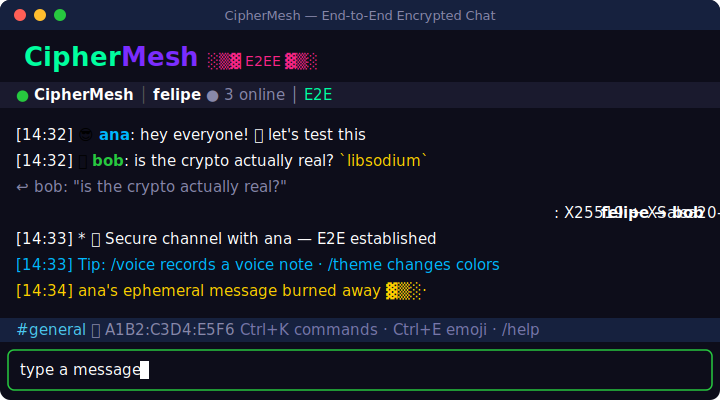

<div align="center">

```
 ██████╗██╗██████╗ ██╗  ██╗███████╗██████╗ ███╗   ███╗███████╗███████╗██╗  ██╗
██╔════╝██║██╔══██╗██║  ██║██╔════╝██╔══██╗████╗ ████║██╔════╝██╔════╝██║  ██║
██║     ██║██████╔╝███████║█████╗  ██████╔╝██╔████╔██║█████╗  ███████╗███████║
██║     ██║██╔═══╝ ██╔══██║██╔══╝  ██╔══██╗██║╚██╔╝██║██╔══╝  ╚════██║██╔══██║
╚██████╗██║██║     ██║  ██║███████╗██║  ██║██║ ╚═╝ ██║███████╗███████║██║  ██║
 ╚═════╝╚═╝╚═╝     ╚═╝  ╚═╝╚══════╝╚═╝  ╚═╝╚═╝     ╚═╝╚══════╝╚══════╝╚═╝  ╚═╝
```

### Chat de terminal com criptografia ponta-a-ponta — o servidor não lê uma palavra.

[](https://github.com/FelipeKreulich/secret-chat-lan/actions/workflows/ci.yml)
[](LICENSE)
[](package.json)
[](docs/ARCHITECTURE.md)

**[🇺🇸 Read in English](README.md)** · [Guia de Setup](docs/SETUP.md) · [Arquitetura](docs/ARCHITECTURE.md) · [Política de Segurança](SECURITY.md)



</div>

---

```
 Você ──[payload cifrado]──▶  Relay (cego)  ──[payload cifrado]──▶  Amigo
        Curve25519 + XSalsa20-Poly1305 · Double Ratchet · zero-knowledge
```

CipherMesh é um chat de terminal onde **a criptografia é o produto**. As chaves
vivem em páginas de memória travadas, cada mensagem usa uma chave nova do
ratchet, e o servidor de relay só enxerga ciphertext — não lê, não altera, não
forja nada. Funciona na sua LAN de cara, e pela internet com
[Tailscale](docs/SETUP.md#connecting-over-the-internet-tailscale) (sem port
forwarding, imune a CGNAT).

## ✨ Destaques

|     | Feature | Resumo |
|-----|---------|--------|
| 🔐 | **E2EE de verdade** | Curve25519 + XSalsa20-Poly1305 via libsodium, chaves em `sodium_malloc` — nunca tocam o disco |
| 🔄 | **Perfect Forward Secrecy** | Double Ratchet: uma chave por mensagem — comprometer hoje ≠ ler ontem |
| 🕶️ | **Resistência a metadados** | Padding de comprimento em buckets fixos em todo ciphertext + cover traffic opcional (`/cover`) pra borrar quando você conversa |
| 🕵️ | **TOFU + SAS** | Alarme de troca de chave (MITM), código de 6 dígitos verificável por voz e badges de confiança **✓/✗** inline ao lado dos nomes |
| 🌐 | **LAN e internet** | Detecta Tailscale sozinho e mostra o endereço alcançável no banner |
| 📨 | **Convites com QR** | `/invite` gera uma string `ciphermesh://` + QR — colou, caiu na sala certa |
| ✓✓ | **Read receipts cifrados** | O ✓✓ viaja como ciphertext comum — o servidor não distingue de mensagem |
| 🗂️ | **Histórico local cifrado** | Opt-in (só com passphrase), Argon2id + XSalsa20-Poly1305, `/search` e `/export` |
| 🖼️ | **Preview de imagens** | Fotos recebidas renderizam no chat em half-blocks coloridos |
| 📎 | **Transferências com resume** | Chunks perdidos são re-pedidos; reconexão retoma de onde parou |
| 💬 | **Cara de app moderno** | Suas mensagens à direita, avatar de emoji por usuário, reply com citação, `:fire:` → 🔥 |
| 🎞️ | **Interface animada** | Splash na abertura, spinner de reconexão, barra de transferência viva (shimmer + ETA), cadeado fechando no handshake e um selo pulsante "novas mensagens ↓" |
| 👻 | **Deniable e efêmeras** | Modo de negação plausível (crypto simétrica); mensagens efêmeras *queimam* caractere a caractere ao expirar |
| 🛰️ | **Modo P2P sem servidor** | Descoberta de peers via mDNS na LAN — sem relay nenhum |

## 🚀 Começando

Rode sem clonar (depois de publicado no npm):

```bash
npx ciphermesh          # cliente (padrão)
npx ciphermesh server   # servidor relay
npx ciphermesh p2p      # P2P sem servidor
```

macOS/Linux com Homebrew (veja [`Formula/ciphermesh.rb`](Formula/ciphermesh.rb)):

```bash
brew tap felipekreulich/ciphermesh
brew install ciphermesh
```

Ou pelo código-fonte:

```bash
git clone https://github.com/FelipeKreulich/secret-chat-lan.git
cd secret-chat-lan
npm install
```

**Quem hospeda** (uma máquina roda o relay):

```bash
npm run server          # ou: docker compose up -d  |  npx ciphermesh server
```

Prefere imagem pronta? Baixe o relay do GHCR (publicado a cada release):

```bash
docker run -p 3600:3600 ghcr.io/felipekreulich/secret-chat-lan:latest
```

**Todo mundo** (incluindo quem hospeda):

```bash
npm run client          # nickname → passphrase (opcional) → endereço do servidor
```

Na mesma rede, use o IP da LAN que aparece no banner do servidor
(`192.168.x.x:3600`). Pela internet, instalem [Tailscale](https://tailscale.com)
dos dois lados e usem o endereço `Internet` do banner — passo a passo completo
em [docs/SETUP.md](docs/SETUP.md).

Já está no chat? Rode `/invite <seu-ip>:3600` e mande a string (ou o QR) pra
quem você quiser puxar pra conversa.

**Sem servidor nenhum?** `npm run p2p` — os peers se encontram via mDNS.

## 💬 Comandos

<details>
<summary><b>Essenciais</b></summary>

| Comando | Descrição |
|---------|-----------|
| `/help` | Todos os comandos |
| `/tips` | Mostra uma dica rotativa de segurança/UX |
| `/users` | Quem está online (com away/status) |
| `/msg <nick> <texto>` | Mensagem privada (DM) |
| `/reply <texto>` | Responde citando a última mensagem recebida |
| `/invite [host:porta]` | Gera convite `ciphermesh://` + QR code |
| `/nick <novo>` | Troca de apelido (antes de entrar — recupera de "apelido em uso") |
| `/quit` | Sair |

</details>

<details>
<summary><b>Salas</b></summary>

| Comando | Descrição |
|---------|-----------|
| `/join <sala>` | Entra/cria uma sala |
| `/rooms` | Lista salas |
| `/room` | Sala atual |
| `/owner` | Dono da sala |
| `/kick` `/mute` `/ban` | Moderação (dono da sala) |

</details>

<details>
<summary><b>Confiança & segurança</b></summary>

| Comando | Descrição |
|---------|-----------|
| `/fingerprint [nick]` | Fingerprint + um **randomart** determinístico da chave |
| `/verify <nick>` | Código SAS (~40 bits) + QR + randomart da chave para verificar |
| `/verify-confirm <nick>` | Marca o peer como verificado |
| `/backup [caminho]` | Backup cifrado da identidade + peers verificados (restaura no startup) |
| `/trust <nick>` / `/trustlist` | Aceita chave nova / status de confiança |
| `/deniable [on\|off]` | Modo de negação plausível |
| `/panic [sim]` | Wipe de coação — apaga com segurança todos os segredos do disco (sessão, histórico, confiança, chaves) e sai |
| `/cover [on\|constant\|off]` | Cover traffic — `on` = iscas com jitter, `constant` = canal de taxa constante |
| `/theme [nome]` | Tema de cores dos nicks: neon, matrix, mono, sunset, ocean |
| `/ephemeral <30s\|5m\|1h\|off>` | Mensagens autodestrutivas |
| `/receipts [on\|off]` | Envio de confirmação de leitura (✓✓) |
| `/audit [n]` | Log de auditoria local |

Um **✓** verde ao lado de um nome indica um peer verificado por SAS; um **✗** vermelho sinaliza uma chave que mudou desde a última vez (possível MITM). Um peer novo não-verificado dispara um lembrete único para `/verify`.

</details>

<details>
<summary><b>Histórico & arquivos</b></summary>

| Comando | Descrição |
|---------|-----------|
| `/file <caminho>` | Oferece arquivo (≤ 50MB) — o destinatário precisa dar `/accept`; retoma |
| `/voice [seg]` | Grava e envia nota de voz cifrada (precisa de `sox`/`ffmpeg`; default 10s) |
| `/play [caminho]` | Toca a última nota de voz recebida (`afplay`/`sox`/`ffplay`) |
| `/accept [id]` / `/reject [id]` | Aceita / recusa uma oferta de arquivo recebida |
| `/img [caminho]` | Renderiza a última imagem recebida em **alta resolução** (kitty/iTerm2) |
| `/retention <7d\|24h\|30m>` | Purga o histórico local mais antigo que o tempo dado |
| `/search <termo>` | Busca no histórico local cifrado |
| `/history [n]` | Últimas n mensagens do histórico |
| `/export [caminho]` | Exporta o histórico em .txt ou .json (texto plano!) |

</details>

<details>
<summary><b>Presença & diversão</b></summary>

| Comando | Descrição |
|---------|-----------|
| `/away [motivo]` / `/back` | Marca/remove ausência |
| `/status <texto\|off>` | Status livre — emoji à vontade (`/status :fire: codando`) |
| `/react <emoji>` | Reage à última mensagem |
| `/edit` `/delete` | Edita/apaga sua última mensagem |
| `/pin` `/unpin` `/pins` | Fixa mensagens |
| `/sound` `/notify` | Notificações sonoras / desktop |
| `/dnd [on\|off\|mentions\|HH:MM-HH:MM]` | Não perturbe, só menções, ou horário silencioso |
| `/clear` | Limpa o chat |

</details>

Digitar `:fire:` em qualquer lugar vira 🔥 (Tab autocompleta shortcodes).
**Ctrl+K** abre uma paleta de comandos fuzzy, **Ctrl+E** um seletor de emoji. PageUp/PageDown rolam o histórico. **Alt+Enter** (ou Shift+Enter onde o terminal suporta, além de Ctrl+J) insere uma nova linha para mensagens de várias linhas; Enter envia. Markdown funciona: \`código\`, **negrito**, *itálico*, links, além de blocos de código \`\`\` e | tabelas |. Imagens recebidas têm preview inline (half-blocks) e renderizam em alta resolução com `/img` no kitty/iTerm2. Separadores de dia e agrupamento de mensagens deixam o log limpo.

### Arquivo de config

Crie um `~/.ciphermesh/config.json` para definir padrões e pular os prompts. Todas as chaves são opcionais (chaves desconhecidas são ignoradas):

```json
{
  "nickname": "felipe",
  "server": "wss://100.x.y.z:3600",
  "sound": false,
  "notify": true,
  "receipts": true,
  "deniable": false,
  "cover": "constant",
  "theme": "matrix",
  "autoAway": 10,
  "dnd": "22:00-08:00"
}
```

`nickname`/`server` pré-preenchem os prompts (Enter aceita); o resto é aplicado na inicialização como se você tivesse rodado o comando `/sound`, `/cover`, `/theme`, … correspondente. Temas: `neon` (padrão), `matrix`, `mono`, `sunset`, `ocean`.

## 🔒 Modelo de segurança

- O relay é **zero-knowledge**: roteia ciphertext com padding anti-metadados e
  nada mais. Read receipts, reações, presença — tudo é ciphertext
  indistinguível pro servidor.
- **Resistência a análise de tráfego**: todo ciphertext é paddado até buckets
  de tamanho fixo (o relay não lê o comprimento da mensagem); chunks de arquivo
  são paddados a um tamanho uniforme, então o tamanho exato do arquivo também
  não vaza. `/cover on` adiciona iscas com jitter e `/cover constant` faz suas
  mensagens saírem por um canal de taxa constante (iscas preenchem os slots
  ociosos), pra ele não distinguir conversa ativa de ociosa. Iscas são
  descartadas em silêncio.
- **Anti-replay** com nonces monotônicos, **rotação de chaves** a cada hora com
  janela de graça, **limpeza segura de memória** (`sodium_memzero`) após o uso.
- **Wipe de coação** (`/panic sim`): sobrescreve e apaga todos os segredos do
  disco (estado da sessão, histórico, confiança, auditoria), zera as chaves em
  memória e sai sem salvar — para um device perdido ou apreendido.
- Estado de sessão e histórico local são cifrados em repouso com
  **Argon2id + XSalsa20-Poly1305** — sem passphrase, nada persiste.
- Análise de ameaças e detalhes do protocolo: [docs/ARCHITECTURE.md](docs/ARCHITECTURE.md).
  Achou algo? Veja [SECURITY.md](SECURITY.md).

## 🧪 Desenvolvimento

```bash
npm run server:dev      # relay com auto-reload
npm test                # 287 testes (crypto, ratchet, fuzz, controllers, transferências…)
npm run validate        # lint + prettier + testes — o mesmo que o CI roda
```

O CI roda em todo push/PR (Node 20 e 22). Tags `v*` disparam testes + GitHub
Release automaticamente.

## 📄 Licença

[MIT](LICENSE) — faça coisas boas com isso.
